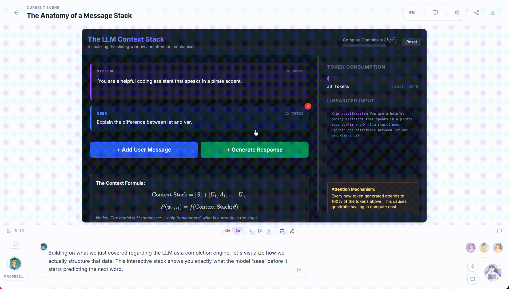

# openLUMA

**openLUMA** is an open-source AI classroom studio that turns a prompt or uploaded PDF into an interactive, multi-agent lesson with slides, quizzes, simulations, project-based learning scenes, and live classroom discussion.

<p align="center">
  <a href="https://openluma.app/">Live demo</a>
  ·
  <a href="#quick-start">Quick start</a>
  ·
  <a href="#features">Features</a>
  ·
  <a href="#api">API</a>
  ·
  <a href="#openclaw">OpenClaw</a>
</p>

## Features

* Generate a full classroom from a free-form prompt or uploaded PDF
* Mix four scene types: `slide`, `quiz`, `interactive`, and `pbl`
* Run multi-agent lessons with teacher, assistant, and student personas
* Enable optional web search, image generation, video generation, TTS, and ASR
* Export editable PowerPoint decks and resource packs
* Self-host with Next.js, Docker, or Vercel

<table>
<tr>
<td width="50%" valign="top">

**Slides and classroom playback**

AI teachers present lessons with canvas-based slides, whiteboard actions, and live discussion.


</td>
<td width="50%" valign="top">

**Quizzes**

Generate single-choice, multi-choice, and short-answer quizzes with grading support.


</td>
</tr>
<tr>
<td width="50%" valign="top">

**Interactive scenes**

Render HTML-based simulations and embedded interactive activities.



</td>
<td width="50%" valign="top">

**Project-based learning**

Create PBL scenes with roles, issue boards, guided chat, and workspace flows.


</td>
</tr>
</table>

Additional capabilities:

* Whiteboard playback, laser and spotlight effects, and discussion TTS
* PDF parsing with `unpdf` or MinerU-compatible backends
* Server-side image, video, and narration generation
* Classroom languages: `en-US`, `hi-IN`, `gu-IN`, `mr-IN`
* Async classroom generation jobs with pollable status
* Persisted classroom JSON under `data/classrooms`

## Tech Stack

* Next.js 16 App Router
* React 19 and TypeScript 5
* pnpm workspace with local `mathml2omml` and `pptxgenjs` packages
* Zustand, LangGraph, ProseMirror, ECharts, Tailwind CSS 4
* Vitest and Playwright

## Quick Start

### Prerequisites

* Node.js 20.9+
* pnpm 10+
* Optional: Docker for containerized local runs

### 1. Install

```bash
git clone https://github.com/your-org/openluma.git
cd openluma
pnpm install
```

### 2. Configure providers

Copy the example env file:

```bash
cp .env.example .env.local
```

openLUMA loads server-side provider settings from:

1. `server-providers.yml`, if present
2. Environment variables from `.env.local` or your host environment, which override matching YAML fields

Generation APIs use the openLUMA server's own provider configuration. They do not automatically reuse credentials from another client or assistant session.

For the smallest setup, configure one LLM provider and set `DEFAULT_MODEL` explicitly if you do not want the default `gpt-4o-mini` fallback.

Example:

```env
GOOGLE_API_KEY=...
DEFAULT_MODEL=google:gemini-3-flash-preview
```

Alternative:

```env
OPENAI_API_KEY=...
DEFAULT_MODEL=openai:gpt-4o-mini
```

If you prefer YAML:

```yaml
providers:
  google:
    apiKey: your-google-key
    models:
      - gemini-3-flash-preview

tts:
  openai-tts:
    apiKey: your-openai-tts-key

web-search:
  tavily:
    apiKey: your-tavily-key
```

Optional provider groups:

* `PDF_*` for PDF parsing
* `TAVILY_API_KEY` for web search
* `IMAGE_*` for image generation
* `VIDEO_*` for video generation
* `TTS_*` for server-side narration
* `ASR_*` for transcription

Important model note:

* Include the provider prefix in `DEFAULT_MODEL`, such as `google:...`, `anthropic:...`, or `openai:...`
* Bare model IDs are parsed as OpenAI models by default

### 3. Run the app

Development:

```bash
pnpm dev
```

Production-like local run:

```bash
pnpm build
pnpm start
```

Docker:

```bash
docker compose up --build
```

Open `http://localhost:3000`.

### 4. Verify the server

```bash
curl -fsS http://localhost:3000/api/health
```

Generated classroom data is stored in:

* `data/classrooms`
* `data/classroom-jobs`

The provided Docker Compose file persists `/app/data` via the `openluma-data` volume.

## Workflow

1. Open the home page.
2. Enter a learning goal or upload a PDF.
3. Choose a classroom language.
4. Optionally enable web search and media features.
5. Review the generated outline in the preview flow.
6. Launch the classroom, interact with the agents, and export when ready.

## API

Useful routes for local integration and smoke testing:

| Route                             | Method         | Purpose                                            |
| --------------------------------- | -------------- | -------------------------------------------------- |
| `/api/health`                     | `GET`          | Service health and optional feature capabilities   |
| `/api/server-providers`           | `GET`          | Exposed server-side provider availability          |
| `/api/parse-pdf`                  | `POST`         | Parse an uploaded PDF                              |
| `/api/generate-classroom`         | `POST`         | Start an async classroom generation job            |
| `/api/generate-classroom/[jobId]` | `GET`          | Poll classroom generation status                   |
| `/api/classroom`                  | `GET` / `POST` | Read or persist a classroom                        |
| `/api/chat`                       | `POST`         | Stateless SSE chat for live classroom interactions |
| `/api/transcription`              | `POST`         | ASR transcription                                  |
| `/api/quiz-grade`                 | `POST`         | Quiz grading                                       |

Example generation request:

```bash
curl -X POST http://localhost:3000/api/generate-classroom \
  -H "Content-Type: application/json" \
  -d '{
    "requirement": "Create an introductory classroom on photosynthesis for middle school students",
    "language": "en-US",
    "enableWebSearch": false
  }'
```

The response returns a `jobId` and `pollUrl`. Poll until `status` becomes `succeeded` or `failed`.

## OpenClaw

The repository includes an OpenClaw skill at `skills/openluma` for guided setup and classroom generation from chat apps.

* Hosted mode uses your deployed openLUMA instance
* Self-hosted mode targets your local or deployed environment
* The skill walks through repo selection, startup mode, provider configuration, health checks, and async classroom generation

If you use OpenClaw / ClawHub:

```bash
clawhub install openluma
```

## Development

Common commands:

```bash
pnpm lint
pnpm check
pnpm format
pnpm test
pnpm test:e2e
pnpm test:e2e:ui
```

For first-time Playwright setup:

```bash
pnpm exec playwright install
```

## Project Structure

```text
openluma/
|- app/                    # Next.js routes and API handlers
|- components/             # UI, playback, renderers, settings, chat
|- lib/                    # generation, orchestration, providers, stores, export
|- packages/               # workspace packages: pptxgenjs, mathml2omml
|- public/                 # static assets and logos
|- e2e/                    # Playwright fixtures and end-to-end tests
|- tests/                  # Vitest unit tests
|- skills/openluma/        # OpenClaw skill and setup references
|- data/                   # generated at runtime for classrooms and jobs
```

Core architectural areas:

* `lib/generation` for outline and scene generation
* `lib/orchestration` for multi-agent chat and director flows
* `lib/playback` for lesson playback state
* `lib/action` for whiteboard, speech, and visual classroom actions
* `lib/server` for provider resolution, job orchestration, and persistence

## Deployment

### Vercel

Deploy using the standard Next.js deployment workflow on Vercel or any compatible hosting provider. Ensure at least one LLM provider API key is configured (for example `OPENAI_API_KEY` or `ANTHROPIC_API_KEY`).

### Docker

```bash
cp .env.example .env.local
docker compose up --build
```

### MinerU

For advanced document parsing, configure a MinerU-compatible backend with `PDF_MINERU_BASE_URL` and, if needed, `PDF_MINERU_API_KEY`. The built-in `unpdf` provider works without extra setup.

## Contributing

Issues, bug reports, and pull requests are welcome. A good place to start is:

1. Run `pnpm lint`, `pnpm test`, and the relevant `pnpm test:e2e` scope.
2. Keep provider-specific changes isolated and update config docs when behavior changes.
3. Include screenshots or short recordings for UI-heavy changes.

## Community

* Community group: see `community/` directory
* Hosted demo: your openLUMA deployment URL

## Citation

If openLUMA helps your research, please consider citing:

```bibtex
@Article{openluma-platform,
  title = {openLUMA: LLM-driven Interactive Classroom Generation Platform},
  journal = {Educational Technology Systems},
  year = {2026}
}
```

## License

This project is licensed under the [GNU Affero General Public License v3.0](LICENSE).

For commercial licensing inquiries, contact `support@openluma.ai`.
